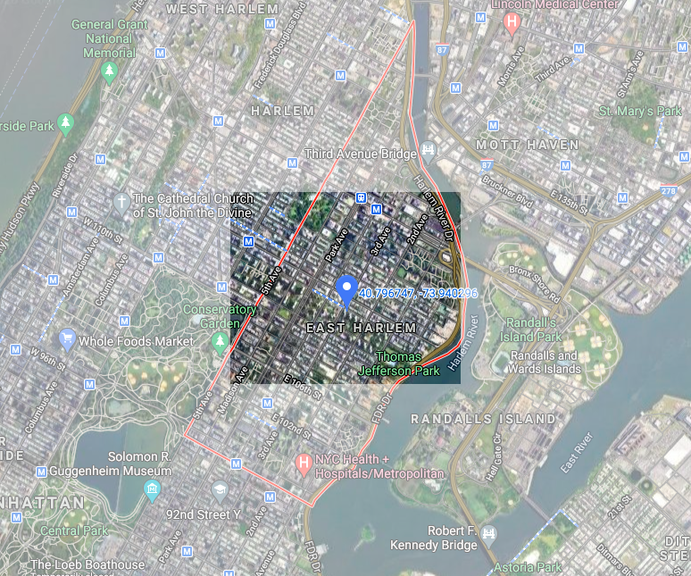
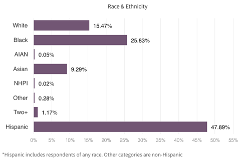
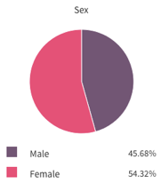
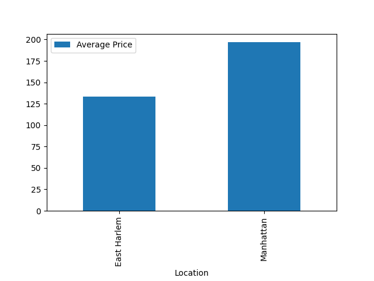
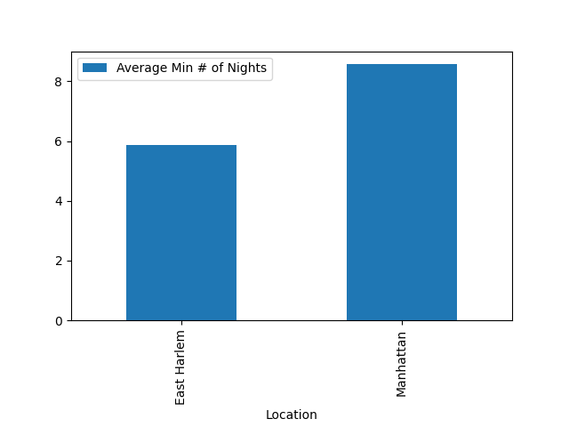
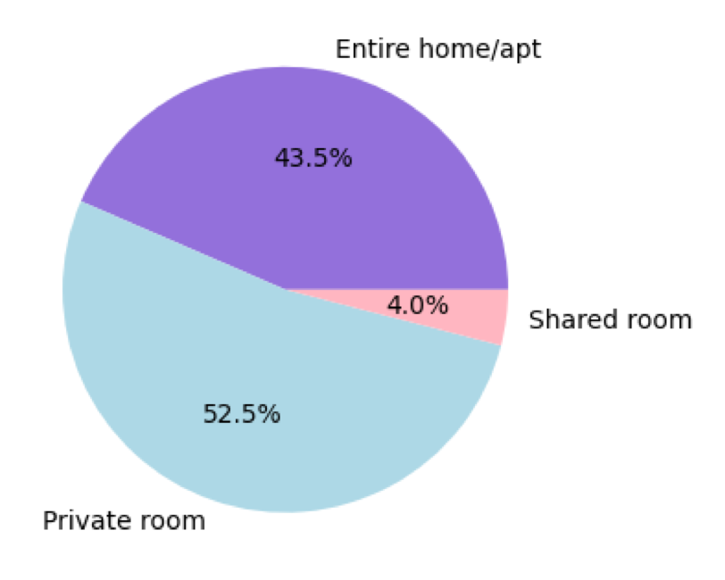

# Welcome to East Harlem.

_You are here._  

### Statistics & Demographics

- **Population**: 115,340  
- **Median Age**: 35.1  
- **Median Household Income**: $34,016  
- **Unemployment Rate**: 10.77%  

  

  

### Living in East Harlem: A Brief Analysis

What makes a neighborhood a desirable place to live? There are many factors that must be taken into consideration, but 3 of the most important qualities are:  
1. Safety
2. Affordability
3. Location  

Let's take a look at how East Harlem fares on these 3 criteria.  

**_Safety_**  East Harlem is not the safest neighborhood, with an overall safety ranking of 44th out of the 69 listed neighborhoods in NYC and 8th out of the 17 listed neighborhoods in Manhattan according to DNA Info's Crime & Safety Report. However, overall crime rates have dropped 70% from 1993 to 2010, with 86% and 81% decreases in car theft and burglaries, respectively, and rates of these property crimes are still much lower than the national average currently. While murder rates in East Harlem are also below the national average, rates of assault are well above the national average and the neighborhood is NYC’s 6th least safe area for rape.  

**_Affordability_**  Cost of living in East Harlem is somewhat high compared to the rest of the country. The median home value is $936,528 and the median rent is $1,037, which are both higher than the national median. However, compared to other neighborhoods in Manhattan, the cost of living in East Harlem is on the less expensive side, with a noticeably lower monthly rent than the other three Manhattan neighborhoods my group explored — East Village, Chinatown, and West Village.  

**_Location_**  East Harlem is in a relatively convenient location, offering many bars, restaurants, coffee shops, and parks for residents to enjoy. Many young professionals live in East Harlem, and the neighborhood has excellent nightlife and diversity. In terms of transportation, residents have access to the 6 train, the Metro North, and the M1, M101, M102, M103, M15, M2, and M98 buses. The average commute to work is 36 minutes. Given the lack of access to more subway lines, the location isn't exactly ideal, but it is certainly not bad either, considering how much more affordable East Harlem is compared to other Manhattan neighborhoods.  

### East Harlem Airbnb Data  

<dl>
<iframe src="East Harlem Airbnb Listings Map.html" width="600" height="400" frameborder="0" frameborder="0" marginwidth="0" marginheight="0" allowfullscreen></iframe>
</dl>
**_Figure 1. Map of Airbnb listings in East Harlem._**  
I generated a map of all of the Airbnb listings in East Harlem using the latitude and longitude values from NYC Open Data's 2019 Airbnb dataset. There is evidently a high density of Airbnb listings covering virtually every area of the East Harlem neighborhood, so travelers have many options to choose from depending on where in East Harlem they would like to stay and what kind of features or amenities they would prefer to have in an Airbnb.  

  
**_Figure 2. Bar graph of average Airbnb price in East Harlem compared to Manhattan._**  
When comparing the East Harlem neighborhood to the Manhattan borough at large, the average Airbnb price in East Harlem is considerably lower than that in Manhattan. The average price for an Airbnb in East Harlem is $133, whereas the average price for an Airbnb in Manhattan is $197. As mentioned previously, price is an important factor to consider when evaluating a neighborhood’s desirability. Thus, it is significant to note that East Harlem is a relatively affordable Airbnb option within the more expensive borough of Manhattan.  

  
**_Figure 3. Bar graph of average minimum # of nights in East Harlem compared to Manhattan._**  
In terms of the required length of stay, Airbnb’s in East Harlem have a lower average minimum number of nights compared to Airbnb’s in Manhattan. A lower minimum number of nights is likely more convenient or preferable for travelers who are renting these Airbnb’s, as those who are looking to go on a brief trip would have fewer restrictions when searching for a place to stay. The average minimum number of nights in East Harlem is 5.86, compared to 8.58 in Manhattan.  

  
**_Figure 4. Bar graph of average reviews per month in East Harlem compared to Manhattan._**  
On average, Airbnb’s in East Harlem have more reviews per month than Airbnb’s in Manhattan. Although average reviews per month is not a perfect metric of the popularity or desirability of an Airbnb listing, this data shows that more travelers were booking Airbnb’s in East Harlem and leaving reviews each month, which suggests that East Harlem is a relatively popular Airbnb neighborhood choice within Manhattan. This was consistent with what I had predicted based on the data from the previous two figures: lower average price and lower average minimum number of nights are two features that might make Airbnb’s in East Harlem a more appealing option compared to Airbnb’s in other areas of Manhattan.  

  
**_Figure 5. Pie chart of Airbnb room types in East Harlem._**  
In terms of safety, while the Airbnb dataset did not contain any information about neighborhood crime rates, another major safety concern at this time is the COVID-19 pandemic. Many travelers now would likely prefer to stay in an Airbnb where they are able to isolate from any strangers and maintain social distance in order to reduce their chances of contracting coronavirus. Therefore, it is ideal that a large proportion of Airbnb’s in East Harlem are either an entire home/apartment or a private room, whereas only 4% are shared rooms. This information is especially important for travelers in 2020 due to our current circumstances, but even in 2019 when this data was collected, many travelers would probably rather have their own space and privacy than share a room with their Airbnb host, so this is a significant feature of Airbnb’s in East Harlem to note regardless.  
